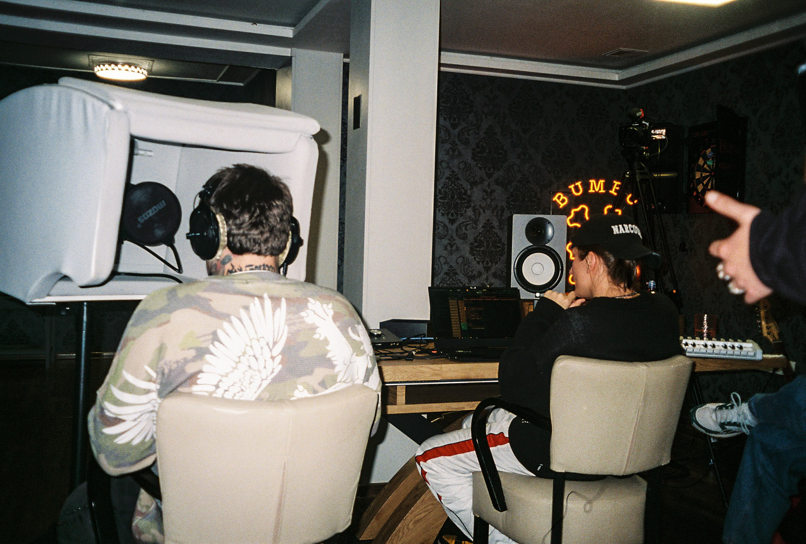
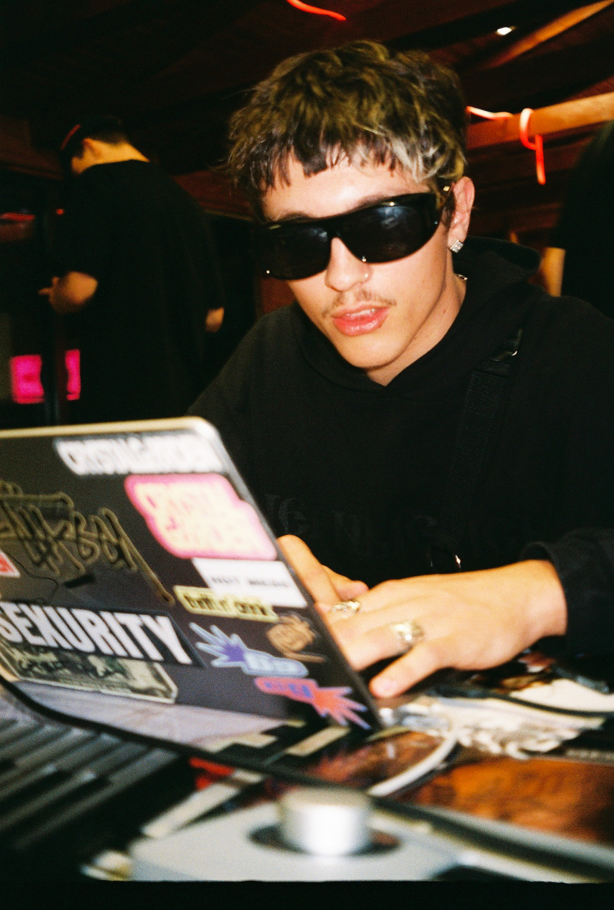
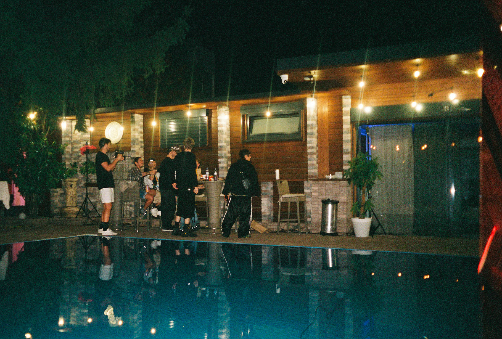
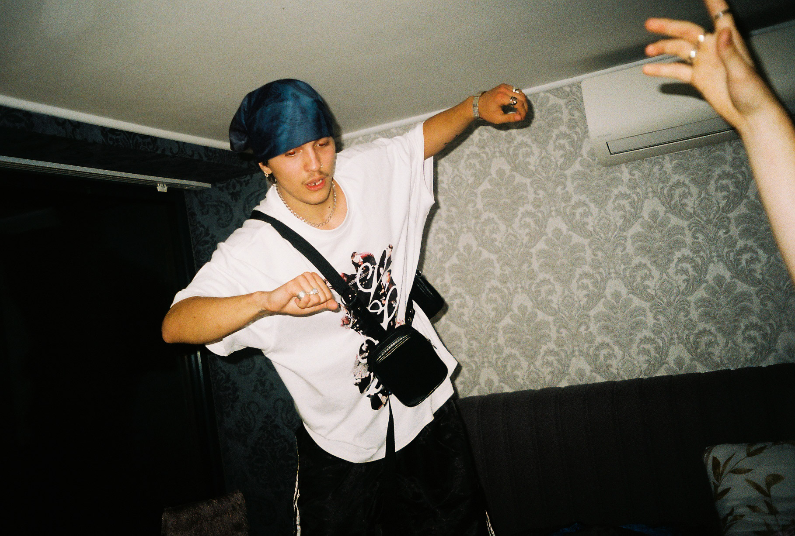
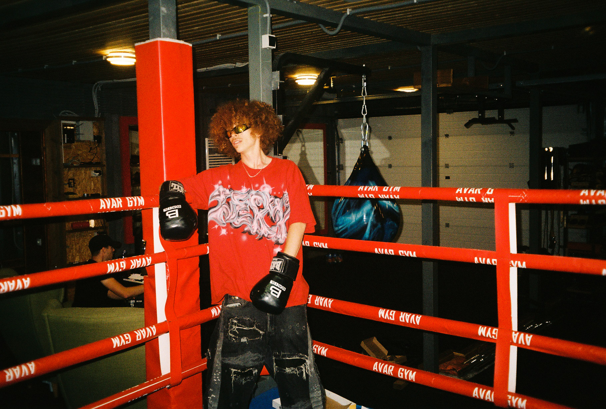

<a href="https://www.youtube.com/watch?v=gDjn9u9QWwM&list=PLvkRLXPWDH-Sy4e-xnUgZO8h4tmqGuyyS" target="_blank" id="playlist-link-4" style="display: block; position: relative; width: 100%; max-width: 85%; aspect-ratio: 16 / 9; border-radius: 4px; overflow: hidden; background-image: url('Assety/COMP_wig35mm-31.jpg'); background-size: cover; background-position: center; background-repeat: no-repeat; margin-top: 1rem;">

</a>

![[COMP_wig35mm-31.jpg]]

